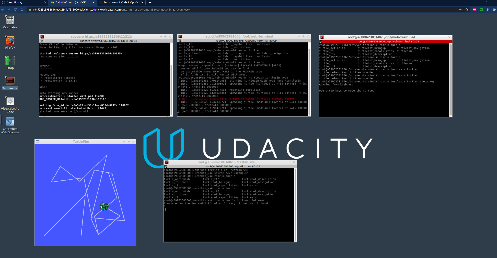

# Capstone Project
Repository for the project submitted as the capstone of the Udacity course on C++.

****

## Project Summary

**Chosen Topic:** ROS Node (not simulated in Gazebo, using the visualization of the turtleSim node instead)

**Project Content:** The goal of this project was the implementation of a ROS node which simulates the control of one or multiple robots which follow a moving target. As a "simulation framework", I used the visualization provided by ROS' *turtleSim* node, where the turtleBot which is used as the moving target is controlled by the keyboard input of the user (via the *turtle_teleop_key* node), while the ROS node which was implemented in this project, *follower*, spawns and controls a number of turtles which then follow the user-controlled turtle.

**Expected Behavior:** After installing and building the necessary software (see sections below), the user (1) is prompted to choose one of three "difficulty levels", which correspond to different configurations of the number, starting position, and movement speed of the follower turtles (the configuration is internally done by choosing and reading in one of the provided configuration files). After this, the follower turtles are spawned in the visualization window of *turtleSim* and follow the turtle which is controlled by the user.

**File Structure (Class and function info can be found in the source code comments):** Overall, a large fraction of the directory and file structure of this project is dictated by ROS. The source code of the ROS node implemented in this project, *turtle_follower*, can be found in *./src/turtle_follower/src*. The text files used for the configuration of the follower turtles are in *./configs*. A good place to start looking at the code is the *./src/turtle_follower/src/main.cpp*, which is the main file of the implemented ROS node and contains the main control logic.

****

## Installation and Build

This section describes the steps necessary to install the ROS package which was developed in this project and build it within a Udacity workspace.

1. ROS is already installed on Udacity workspaces
2. Create a ROS workspace for the package. Open a terminal and enter the following commands (at the time of submission, the workspace had the 'kinetic' version of ROS installed):
    ```
        source /opt/ros/kinetic/setup.bash

        mkdir -p ~/catkin_ws/src
        cd ~/catkin_ws
        catkin_make
    ```
3. Clone the project repository from GitHub, copy the ROS package into the created ROS workspace, set the environment variables, and compile the workspace:
    ```
        cd ~
        git clone https://github.com/FedorSmirnov89/UdacityCppCapRos.git
        cd ../catkin_ws/src
        cp -r ../../UdacityCppCapRos/src/turtle_follower/ .
        cd ~/catkin_ws
        source devel/setup.sh
        catkin_make
    ```
4. After this, the 'turtle_follower' package should be visible to ROS and you can proceed to running the program (next section).

Basically the installation of ROS. Will write this as I go along getting the stuff to work on the virtual machine. But actually it should not be much more than the basic ROS installation.

****

## Running the Program:

This section contains a description how the program can be started within the Udacity workspace. This is done using multiple terminal windows, e.g., using the 'Terminator' application available in the workspace:

1. Open up a terminal window and start 'roscore' by entering the following command:
    ```
        roscore
    ```
2. Open up ANOTHER terminal window and start a turtlesim node by entering the following command:
    ```
        rosrun turtlesim turtlesim
    ```
3. Open up ANOTHER terminal window and start the package used to control the turtle with the arrow keys:
    ```
        rosrun turltesim turtle_teleop_key
    ```
    In order to control the leading turtle, you will have to focus on the terminal where you executed this command, for example by clicking into the terminal window.
4. Open up ANOTHER terminal window and start the package implemented within this capstone project by entering the following commands:
    ```
        cd ~/catkin_ws
        source devel/setup.sh
        rosrun turtle_follower follower
    ```
    The program will then prompt you to enter an integer to determine the difficulty of the chase. After that, it will spawn the corresponding number of follower turtles. You can then control the leading turtle by clicking into the teleop console window and using the arrow keys. The whole arrangement of the workspace could look like the screenshot shown below:



****

## Capstone Project Rubrics

In this last section, I will address how the submitted project addresses the individual topics from the capstone project rubric.

### A README with instructions is included with the project

- See the document at hand, particularly the section on installation and build

### A README indicates which project is chosen

- See the **Project Summary** section

### A README includes information about each rubric point addressed

- See current section

### The submission must compile and run

- Using ROS' **catkin_make** command for compiling and the **rosrun** command for running the implemented ROS node

### Loops, Functions, I/O

- Both **for** and **while** loops, as well as **if** branches are used in various parts of the project
- The project code is organized into functions, which are in turn organized into header files according to their responsibility within the project.
- The project reads configuration data --- the number and settings of the follower turtles --- from an external file as part of the necessary operation of the program.
- The project accepts input from the user --- the choice of the *difficulty level* --- as part of the necessary operation of the program.

### Object Oriented Programming

- The project code is organized into classes --- the follower turtles are implemented as classes --- with class attributes to hold the data, and class methods to perform tasks.
- All class data members are explicitly specified as public, protected, or private.
- All class member functions (and all other functions) document their effects, either through function names, comments, or formal documentation. Member functions do not change program state in undocumented ways (TODO)
- Appropriate data and functions are grouped into classes. Member data that is subject to an invariant is hidden from the user. State is accessed via member functions (TODO + elaborate on this one)

### Concurrency

- The project uses multiple threads in the execution (Elaborate, but it will mostly be about the multi-threaded chase steps; also say that a lot of it is made easier by ROS)


